<figure>
  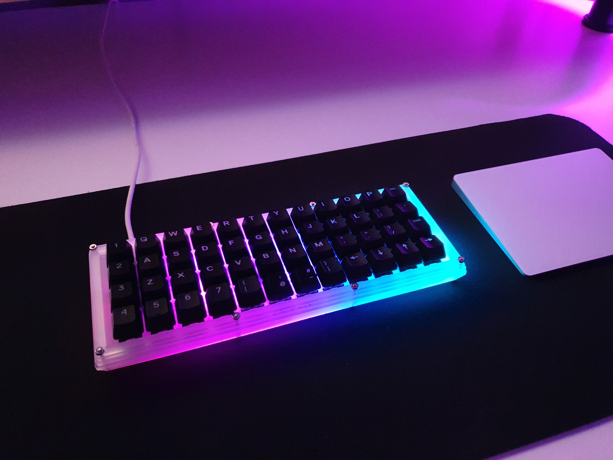
</figure>

Merhaba, bu yazıda yukarıdaki planck klavyenin yapım sürecinden bahsedeceğim.

## **Başlangıç**

Yıllardır mekanik klavyelere ilgili birisiyim. Mekanik klavye kullanmaya 2016'da %75 layouta sahip bir model ile başladım, 2018'de %100luk full-size bir mekanik klavyeye geçtim. O dönemde redditteki [r/Mechanical Keyboards](https://www.reddit.com/r/MechanicalKeyboards/) ve [r/olkb](https://www.reddit.com/r/olkb/) subredditlerini yoğun şekilde takip ediyordum. Bir süre sonra ben de yapmaya karar verdim.

## **Rev 1.0 (2019)**

<figure>
  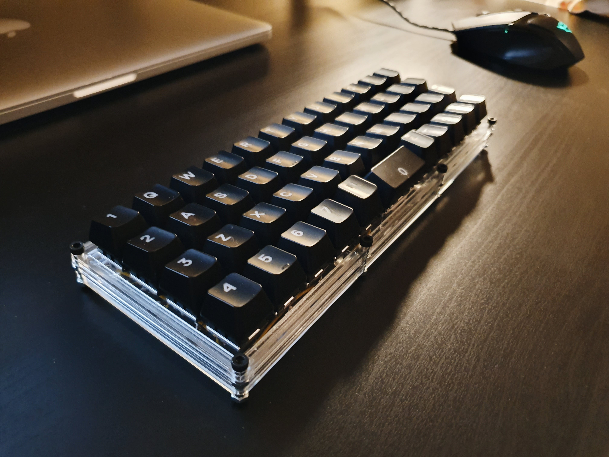
</figure>

%100 layout, boyut ve ağırlık(1.3kg) anlamında dezavantaj yaratmaya başladığında küçük ve taşınabilir bir klavyeye geçme düşüncem şekillenmeye başlamıştı. Planck klavyeyi gözume kestirdim, nasıl yapıldığını araştırıp klavye için gerekli ekipmanları temin ettim. Kasa için 2mm plexiglass kullandım, switch ve keycap'leri halihazırda kullandığım mekanik klavyeden aldık.

<figure>
  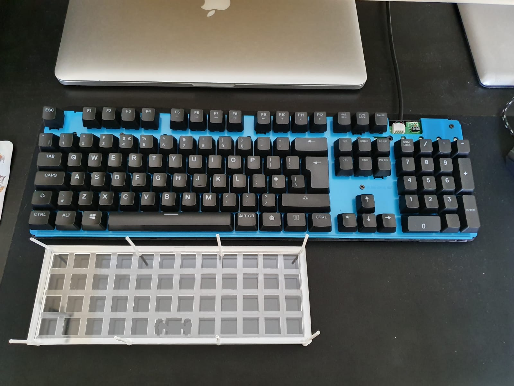
</figure>

O dönemde elektronik ile ilgi ve alakam sıfır olduğu için elektronik konusunda bilgili arkadaşım [Burkay](https://twitter.com/burkay_durdu)'dan yardım istedim. Beraber ilk custom build'ımızı tamamladık. Space tuşundan anlaşılacağı üzere Planck MIT layout tercih ederek 2u büyüklüğünde space kullandık.

<figure>
  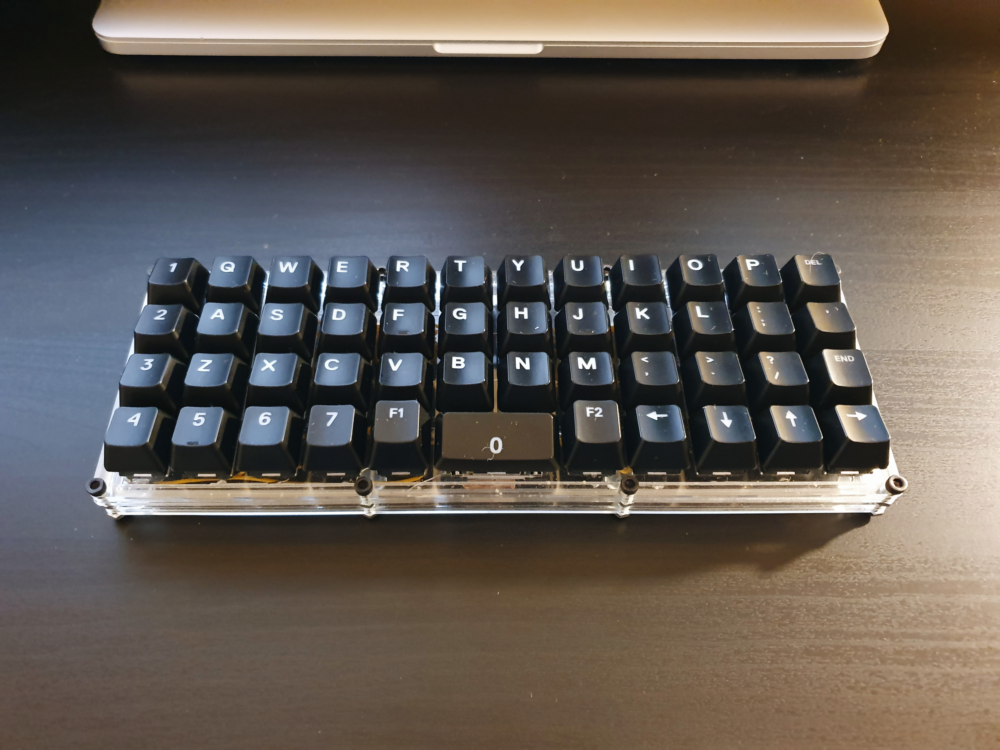
</figure>

Klavyeyi kullanmaya başladım, hatta çantamda taşıyabilmek için bir taşıma kesesi diktim. Kısa bir süre sonra bazı tuşlarda temassızlık ve kasanın plate kısmında çatlamalar oldu.

<figure>
  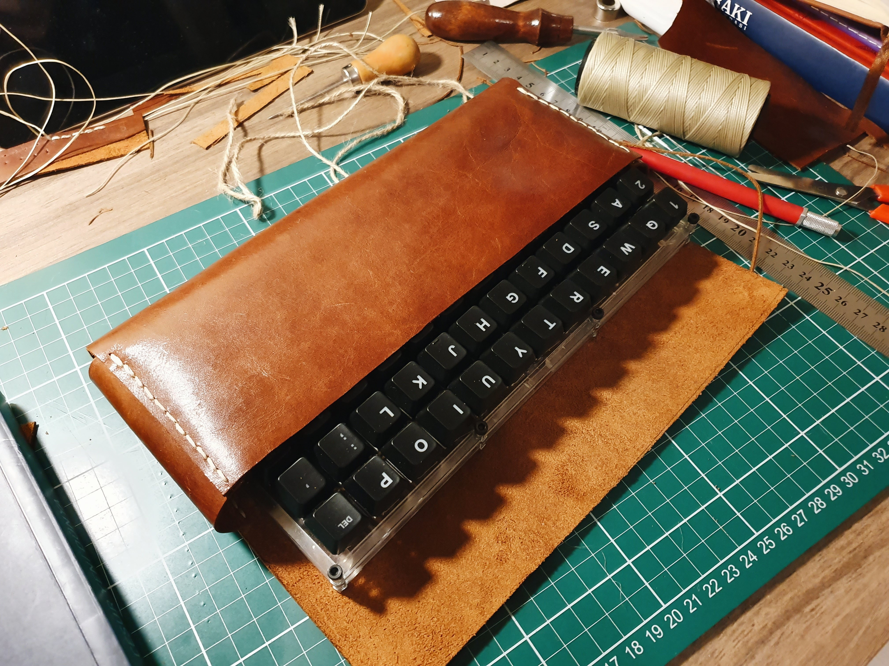
</figure>

Ve ben klavyeyi rafa kaldırdım.

## **(2020)**

2020 içerisinde klavyeyi düzeltmeyi ve tekrar kullanmaya başlamayı çok istesem de pandemi nedeniyle o motivasyonu yakalayamadım.

## **Rev 2.0 (2021)**

<figure>
  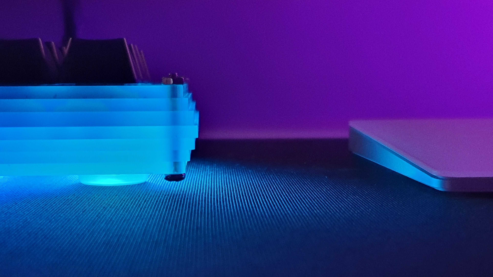
</figure>

Aslında 2021 de 2020'den çok farklı ilerlemiyordu ancak [Seyfeddin Bassarac](https://twitter.com/seyfoyun/status/1360541734351089665?s=20)'ın twitch'teki mekanik klavye yayını ve [Fatih Arslan](https://twitter.com/fatih/status/1359053871889457154?s=20)'ın mekanik klavyeye geçisi motivasyonumu yükseltti.

2019 sonunda figma üzerinde yeni bir kasa çizip bunu 3mm'lik plexiglass ile kestirmiştim.

<figure>
  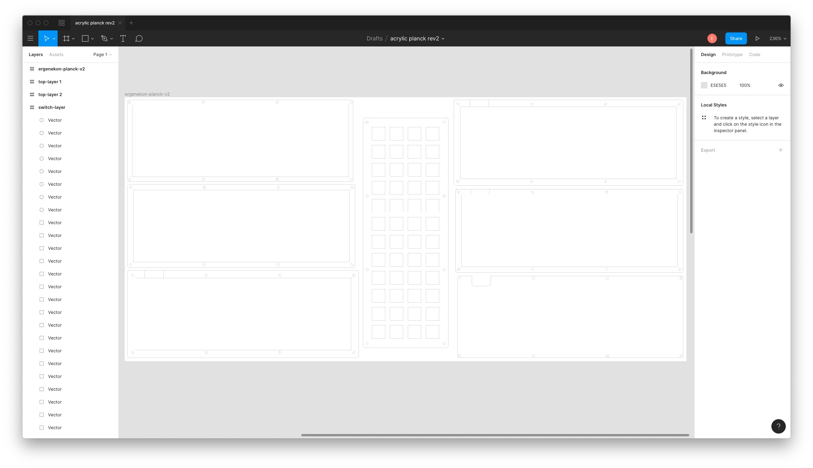
</figure>

Kesimden sonra fark ettim ki kayma olmuş, figma bu iş için doğru araç olmayabilir. [Detay](https://twitter.com/ergenekonyigit/status/1204873954357366784?s=20)

<figure>
  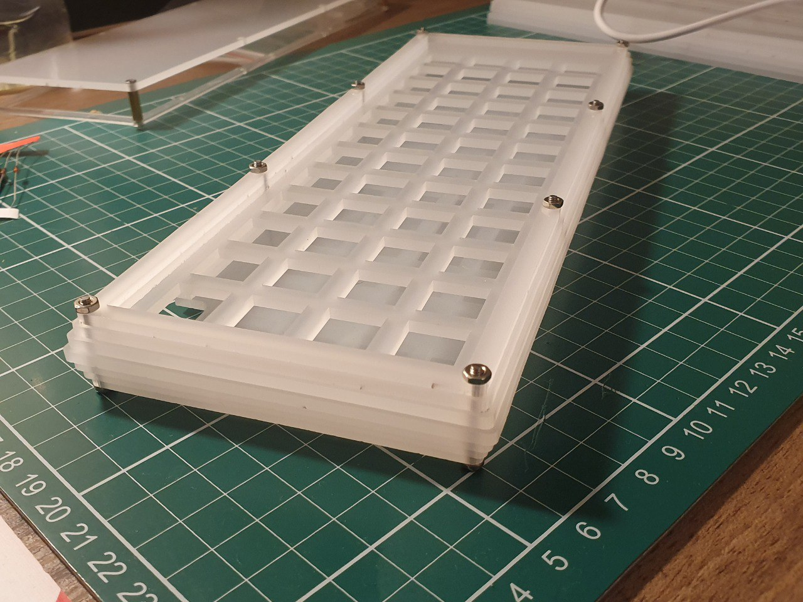
</figure>

Yeni plate 3mm kalınlığında olduğundan switchleri sabit tutabilmek için sıcak silikon ile yapıştırdım, diyotları ve sütunları lehimledim. Bu sefer önceki buildden farklı olarak Planck Grid layout tercih ettim. 1 tane 2u space yerinde 2 tane 1u space tuşu koydum.

Switch olarak eski buildi parçalayıp çoğunlukla aynı switchlerden devam ettim. 43 adet SteelSeries QX1 Linear, [Arda Kılıçdağı](https://twitter.com/ardadev)'nın 2019'da test için yolladığı 4 adet Gateron Brown (space ve layer tuşları) ve 1 adet Zealios V2 (backspace tuşu).

<figure>
  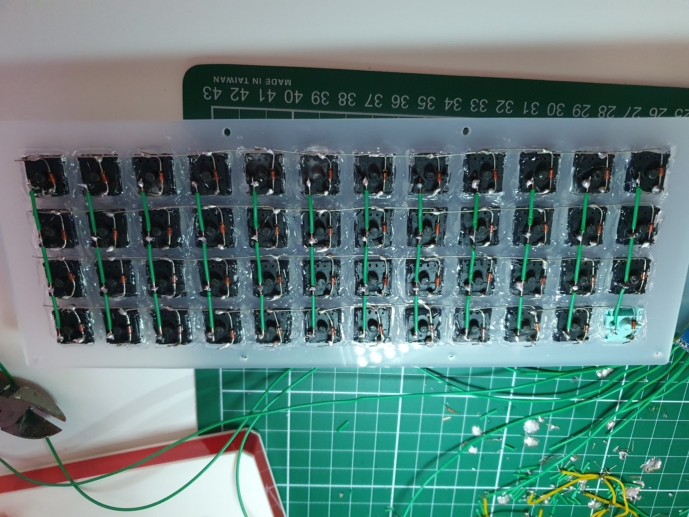
</figure>

Daha sonra satırları ve sütunları Pro Micro'ya bağlayıp tüm tuşların çalışıp çalışmadığını kontol ettim. Her tuşun çalıştığından emin olduktan sonra 6li led şeriti bağlayıp kasayı kapattım.

<figure>
  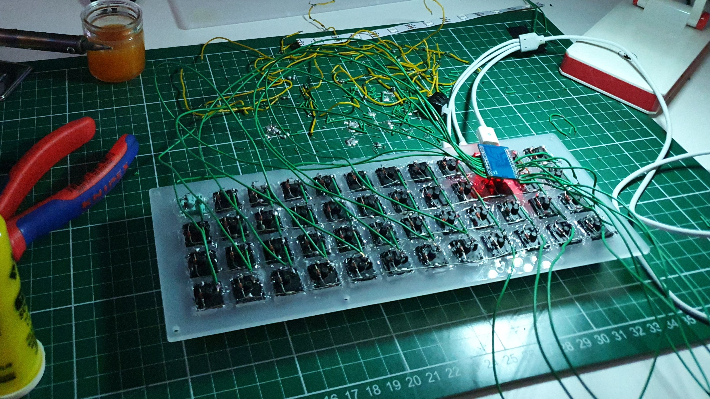
</figure>

### **Yazılım**

Yazılım olarak Qmk Firmware kullandım, açık kaynak olarak GitHub'ıma koydum. [Glosso](https://github.com/ergenekonyigit/glosso)

Şu an kullandığım keymap'e [buradan](https://github.com/ergenekonyigit/glosso/tree/main/keymaps/default) ulaşabilirsiniz.

Yanlış hatırlamıyorsam Pro Micro'nun belleği 20 civarinda layer'a kadar yetiyor. Hangi tuşa başıldığında ne yapması gerektiğini kod üzerinden belirlediğiniz için yapılabileceklerin sınırı hayal gücünüz aslında. [Örnek](https://twitter.com/neoberg/status/1157658827300528128?s=20)

### **Kapanış**

İlk görselle bu görsel arasında bazı tuslar farklı. Bunun nedeni tamamen ergonomik olarak bu düzenin daha rahat hissettirmesi.

<figure>
  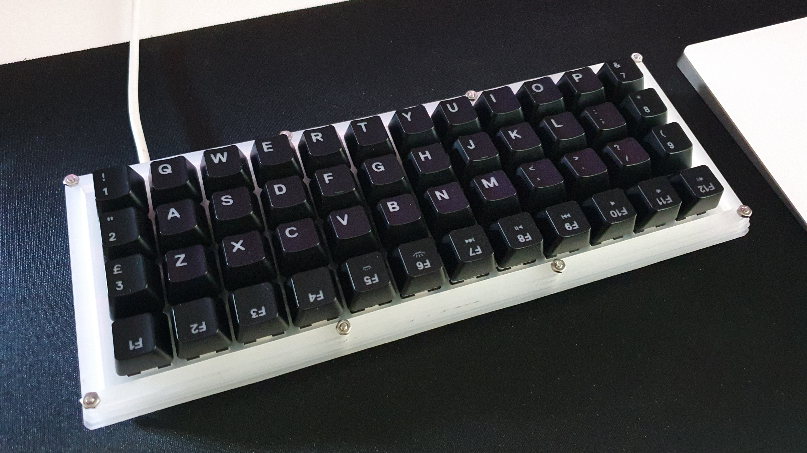
</figure>

Genel olarak planck kullanmaktan memnunum. İlk seferde olduğu gibi standart layout ve ortholinear layout arasında geçişte zorlanmadım. Rahatça bu klavye ve laptop klavyesi arasında geçiş yapabiliyorum. Şimdilik burada da qwerty layout kullanmaya devam ediyorum.
