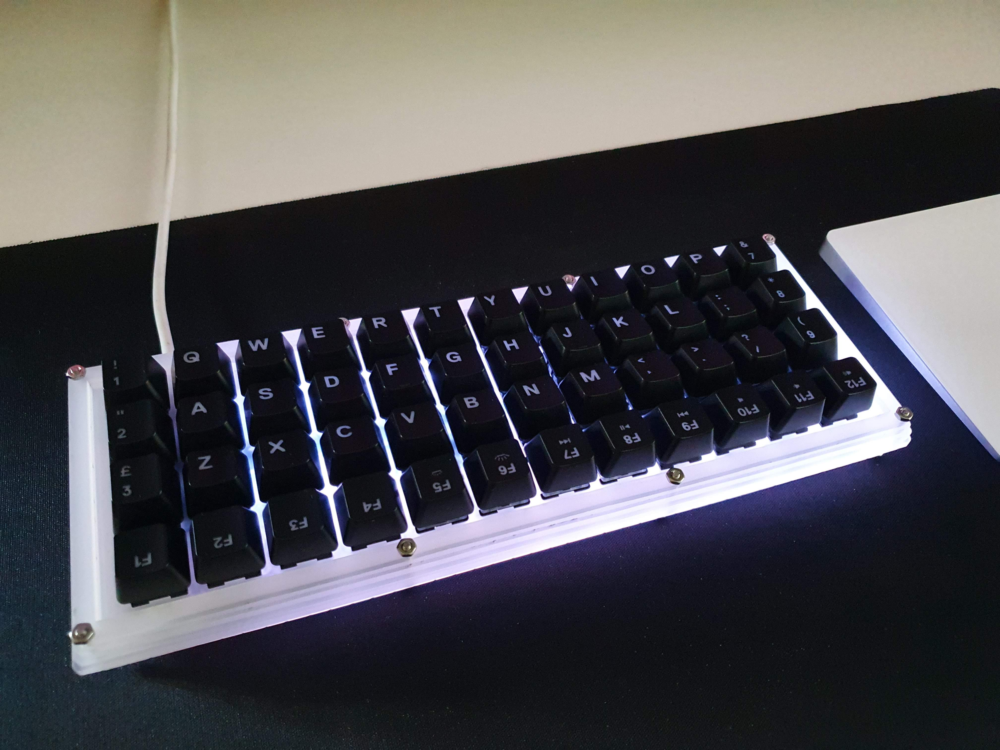
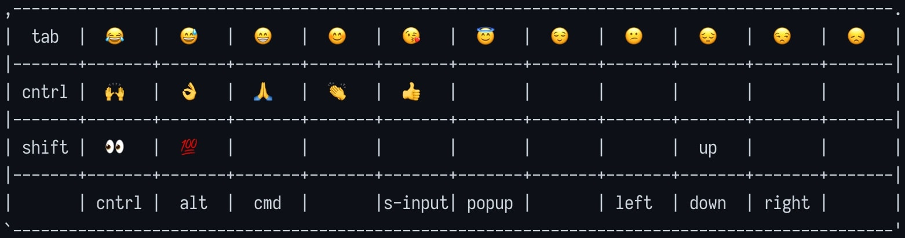
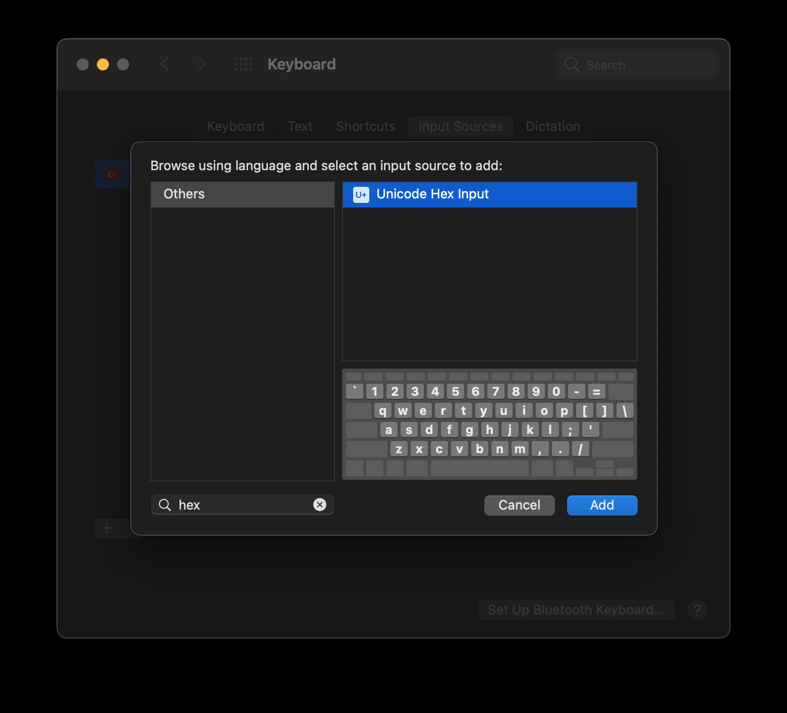

<figure>
  
</figure>

Klavye yapım sürecini [buradan](https://ergenekonyigit.github.io/planck-keyboard/) okuyabilirsiniz.

Merhaba, yakın zamanda klavyeme emojilerden oluşan bir layer ekledim, bu süreçte karşılaştığım sorunlardan ve uyguladığım çözümden bahsedeceğim.

Klavyede [qmk firmware](https://beta.docs.qmk.fm) kullandığımdan bir önceki yazıda bahsetmiştim. Qmk dokümanı altında [unicode](https://beta.docs.qmk.fm/using-qmk/software-features/feature_unicode) desteğini 3 faklı yöntemle nasıl uygulanacağı anlatılmış. Ben bunlardan [Unicode Map](https://beta.docs.qmk.fm/using-qmk/software-features/feature_unicode#1-2-unicode-map-id-unicode-map) yöntemini tercih ettim.

[rules.mk](https://github.com/ergenekonyigit/glosso/blob/main/rules.mk#L33) dosyasinda unicode map'i açtım. Kullanacağım emojileri [unicode_names](https://github.com/ergenekonyigit/glosso/blob/main/keymaps/default/keymap.c#L75-L100) enum'ına çıkardım.

```c
enum unicode_names {
    // Row 0
    JOY,   // 😂
    SMIL2, // 😅
    SMILE, // 😁
    GRIN,  // 😊
    KISS,  // 😘
    HALO,  // 😇
    PHEW,  // 😌
    CONFU, // 😕
    PENSV, // 😔
    UNAMU, // 😒
    DISAP, // 😞

    // Row 1
    CELE,  // 🙌
    OK,    // 👌
    PRAY,  // 🙏
    CLAP,  // 👏
    THMUP, // 👍

    // Row 2
    EYES,  // 👀
    HUNRD  // 💯
};
```

 Bu seçtiğim emojilerin unicode değerlerini [unicode-table](https://unicode-table.com/en/) üzerinden bulup [unicode_map](https://github.com/ergenekonyigit/glosso/blob/main/keymaps/default/keymap.c#L102-L126) icerisinde eşleştirdim.

 ```c
const uint32_t PROGMEM unicode_map[] = {
    // Row 0
    [JOY]   = 0X1F602,
    [SMIL2] = 0x1F605,
    [SMILE] = 0x1F601,
    [GRIN]  = 0x1F600,
    [KISS]  = 0x1F618,
    [HALO]  = 0x1F607,
    [PHEW]  = 0x1F60C,
    [CONFU] = 0x1F615,
    [PENSV] = 0x1F614,
    [UNAMU] = 0x1F612,
    [DISAP] = 0x1F61E,

    // Row 1
    [CELE]  = 0x1F64C,
    [OK]    = 0x1F44C,
    [PRAY]  = 0x1F64F,
    [CLAP]  = 0x1F44F,
    [THMUP] = 0x1F44D,

    // Row 2
    [EYES]  = 0x1F440,
    [HUNRD] = 0x1F4AF
};
 ```

 [_EMOJI](https://github.com/ergenekonyigit/glosso/blob/main/keymaps/default/keymap.c#L220-L236) adında bir layer oluşturup emojileri bu layer'a ekledim. Layer'in son hali aşağıdaki gibi oldu.

<figure>
  
</figure>

İkinci aşamada belirtilen unicode hex input klavyesini ekledim.

<figure>
  
</figure>

Burada karşılaştığım sorun emojileri düzgün ekrana basabilmek için hex inputuna anlık geçip daha sonra diğer input yöntemine dönmekti.

Bunun için yaptığım "hacky" çözüm EMOJI adında bir macro oluşturup bu EMOJI tuşuna basıldığı an, önce ctrl+alt+space ile hex iput switch'ine geçip daha sonra _EMOJI layer'ını aktif etmek, tuştan parmak kaldırıldığında da yeniden ctrl+alt+space ile bir sonraki input source'a geçmek oldu.

```c
case EMOJI:
    if (record->event.pressed) {
        register_code(KC_LCTL);
        register_code(KC_LALT);
        register_code(KC_SPC);
        layer_on(_EMOJI);
        unregister_code(KC_LCTL);
        unregister_code(KC_LALT);
        unregister_code(KC_SPC);
    } else {
        register_code(KC_LCTL);
        register_code(KC_LALT);
        register_code(KC_SPC);
        layer_off(_EMOJI);
        unregister_code(KC_LCTL);
        unregister_code(KC_LALT);
        unregister_code(KC_SPC);
    }
    break;
```

Böylece emoji layer'ını sorunsuz şekilde kullanmaya başladım. Yukarıda dediğim gibi bu benim "hacky" çözümüm, eğer daha verimli bir çözüm bulmuş ve kullanıyorsanız github'dan issue veya pr açabilirsiniz.
