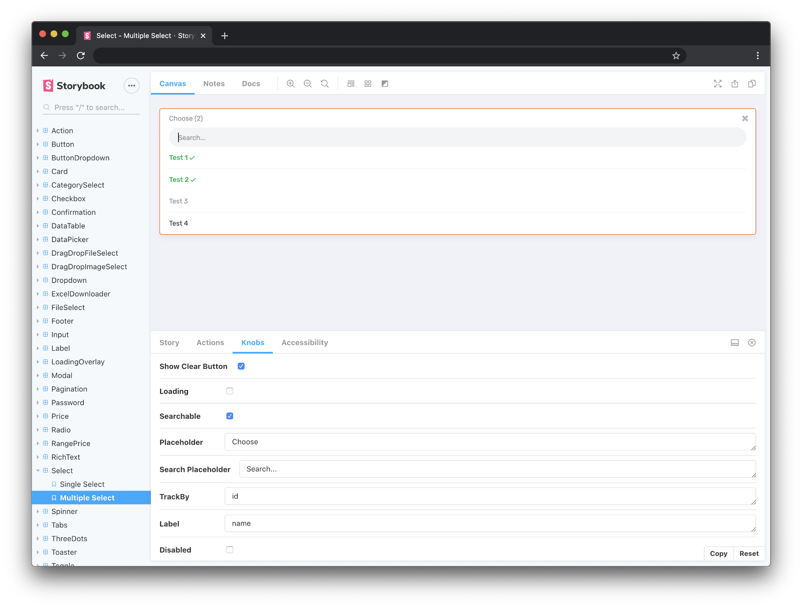
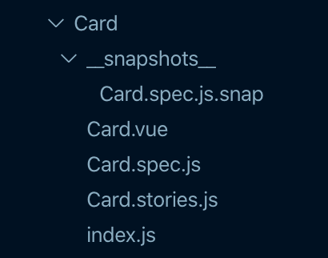
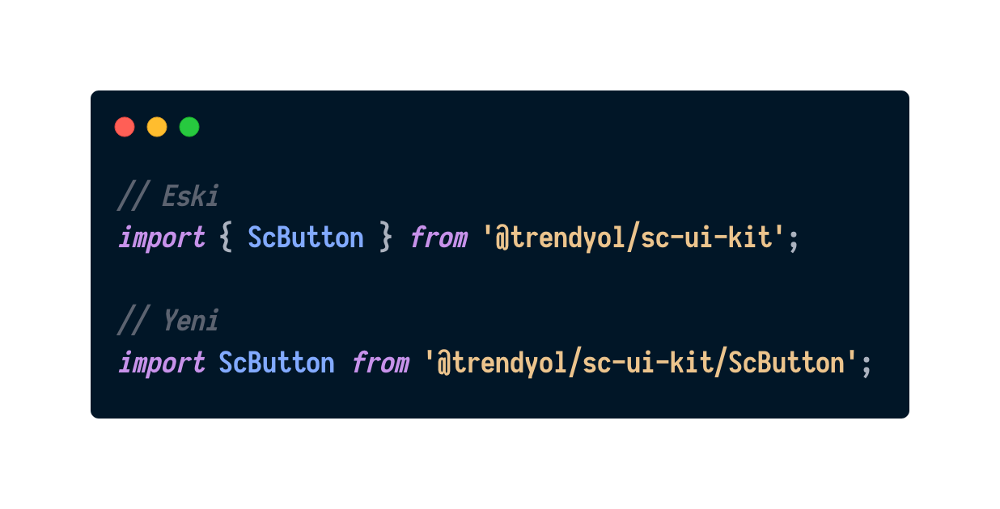
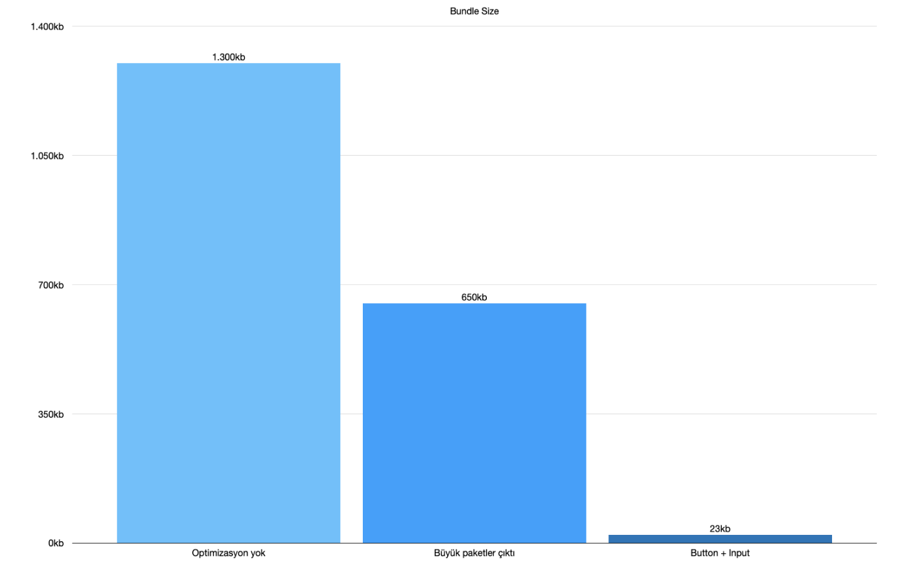

> [Yazının orijinaline buradan ulaşabilirsiniz.](https://medium.com/trendyol-tech/seller-center-optimizasyon-g%C3%BCnl%C3%BCkleri-1-ui-k%C3%BCt%C3%BCphanesi-8fc38fdc86c8)

Bu seride Trendyol Seller Center üzerinde yaptığımız çeşitli optimizasyonları derleyeceğiz. İlk yazı konusu olarak geliştirdiğimiz UI kütüphanesinde yaptığımız iyileştirmelerden bahsettik. Keyifli okumalar.

Seller Center, Trendyol içerisinde satış yapan işletmelerin ürünlerini yükleyip düzenleyebildiği, kampanyalar oluşturabildiği, sipariş süreçlerinin bulunduğu, finans metriklerinin takibini yapabildiği çok boyutlu bir platform.

### UI Kütüphanesi oluşturulması

2020 başında frontend altyapımızı monolith’ten micro frontend’e taşıdık. Geçiş süreci ile ilgili yazıya aşağıdan ulaşabilirsiniz.

[Micro Frontends: How It Changed Our Development Process](https://medium.com/trendyol-tech/micro-frontends-how-it-changed-our-development-process-a5cf667356da)

Micro frontend yapısına geçmeden önce komponentler monolith uygulama içerisinde components/ klasörü altında bulunuyordu. Geçiş sırasında bu komponentleri ayrı bir projeye çıkarma işine başladık. Ayrı projeye çıkarma sürecinde dokümante edebilmek icin Storybook tercih ettik. Storybook içerisindeki knobs eklentisi sayesinde komponentlerin aldığı prop’ları dinamik olarak değiştirerek davranışlarını rahatlıkla gözlemleyebilir hale geldik. Aşağıda örnek bir komponenti ve aldığı prop’larını görebilirsiniz.

<figure>
  
  <figcaption>Seller Center UI Kütüphanesi</figcaption>
</figure>

Trendyol’da testin önemi çok yüksek, biz de her komponentin unit ve snapshot testleri olmasına özen göstererek geliştirmelerimizi yaptık. Günün sonunda 30'un üzerinde komponenti taşıdık. Dosya yapısında tutarlılık sağlamak icin aşağıdaki düzeni tüm komponentlerde uyguladık.

<figure>
  
  <figcaption>Dosya yapısı</figcaption>
</figure>

Bu noktaya kadar her şey çok güzel gelmişti ancak bir sorun vardı, bundle size.

### Büyük Bağımlılıkların Bundle içerisinden Çıkarılması

UI kütüphanesi içerisinde rich text editor, drag and drop, date picker ve input mask gibi büyük paketler içeriyordu. Bu paketler hiç kullanılmayacak bile olsa bundle içerisinde geliyordu. Optimizasyon işine buradan basladık. Paketleri bundle anında ana bundle’dan çıkararak kullanılacağı app içerisinde yüklenmesine karar verdik. Bu optimizasyon sayesinde bundle size’ımız yaklaşık 405kb kadar küçüldü. Tekil bakıldığında boyutu makul gözüken paketler bir araya geldiğinde ciddi yük bindirebiliyor.

### Moment.js Yerine Day.js Kullanılması

Tarih/saat dönüşümleri her uygulamada yapılan bir işlem. Micro frontend öncesinde biz de bu dönüşümler için moment.js kullanıyorduk. Moment.js çok başarılı olmasına rağmen boyut anlamında bir o kadar başı dertte olan bir kütüphane. UI kütüphanesi oluşturmaya başladığımızda burada da bir optimizasyon yapmak istedik. Moment.js kullandığımız yerleri neredeyse aynı api’a sahip ama çok daha makul boyutlarda olan day.js ile değiştirmeye başladık. Bu geçiş sonrasında bundle size’ımda yaklaşık 270kb’lık bir küçülme yaşandı.

Bu noktada %50 oranında iyileştirme sağladık ancak yine de 650kb civarında bir paket yükletmemiz gerekiyordu. Micro frontend altınaki bazı uygulamalar sadece birkaç komponente ihtiyaç duyuyordu. Biz ise 30'un üzerinde komponenti import etmesini istiyorduk.

### Komponentlerin Bağımsız Paketlenmesi

Nasıl daha iyi yapabiliriz diye düşündük ve bundle anında her komponentin bağımsız olarak paketlenmesinin güzel bir optimizasyon olabileceğine karar verdik. Komponentleri stillendirirken scoped css tercih ettik. Bunun avantajını bundle anında da kullanarak css’leri ayrı dosyalarda tutmayıp komponentlerin içerisinde bıraktık. Böylece örneğin ScButton.js dosyası tek başına çalışabilir hale geldi. Her komponentin ayrı dosyada paketlenmiş olması bu komponentleri çağırırken ufak bir değişiklik yapmamızı gerektirdi. Artık herhangi bir komponenti import etmek istediğimizde tüm bundle içerisinden değil de komponentin bundle’ını import etmemiz gerekti.

<figure>
  
  <figcaption>import</figcaption>
</figure>

### Örnek Uygulama

Micro frontend mimarisini üzerinde çalışan 15'in üzerinde micro-app’imiz var. Bunlardan account-app’i inceleyecek olursak; giriş, kayıt ol ve parola değiştirme ekranları olan ufak bir micro-app. Bu uygulama UI kütüphanemizden sadece button ve input komponentlerini kullanıyor. Aşağıdaki grafikte yapılan iyileştirmeler sonucunca bu iki komponentin account-app’ine olan maliyetini görebilirsiniz.

<figure>
  
  <figcaption>bundle size</figcaption>
</figure>

### Sonuç

Büyük paketlerin çıkarılması ve Day.js geçişi herkese önerebileceğim iyileştirmeler olacaktır. Komponentlerin bağımsız paketlenmesinde ise durum biraz farklı. Webpack, Rollup gibi modern bundler’lar benzer tree-shaking yani dead code elimination özelliklerine sahipler ve yeterli optimizasyonu sağlıyorlar. Bizim tercihimiz ise bu adımı micro-app’ler içerisinde değil de sorunun kaynağında çözmek oldu. Bu yöntem herkes için doğru olmayabilir. Ama böyle de bir çözüm olduğundan bahsetmek istedim.

Umarım okurken keyif almışsınızdır. Görüşmek üzere :)

<figure>
  
</figure>
